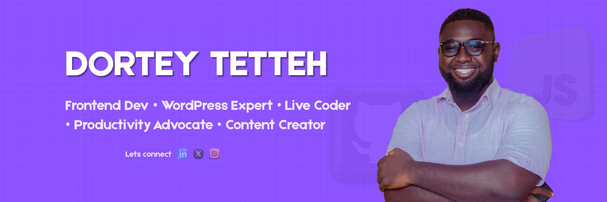

I'm a software engineer who’s passionate about making coding accessible, empowering new developers through mentorship, and using technology to elevate communities. I love simplifying complex tech like JavaScript and React, and helping others stay productive and consistent — especially through live coding sessions, Notion systems, and real-world project guidance.  Technologies I enjoy working with include React, WordPress, and Jamstack (JavaScript, APIs, Markup). I’m the founder of Deloqistudios, and I also mentor aspiring developers through open-source and frontend projects.  My mission? To build, teach, and inspire — one line of code at a time.

# 💻 Tech Stack
                  

# 📊 GitHub Stats

 

<!-- Proudly created with GPRM ( https://gprm.itsvg.in ) -->

<!--START_SECTION:waka-->

name: Waka Readme

on:
  schedule:
    # Runs at 12am IST
    - cron: '30 18 * * *'
  workflow_dispatch:
jobs:
  update-readme:
    name: Update Readme with Metrics
    runs-on: ubuntu-latest
    steps:
      - uses: anmol098/waka-readme-stats@master
        with:
          WAKATIME_API_KEY: ${{ secrets.WAKATIME_API_KEY }}
          GH_TOKEN: ${{ secrets.GH_TOKEN }}

<!--END_SECTION:waka-->

